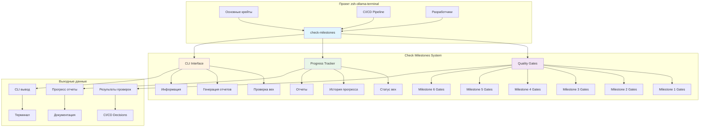
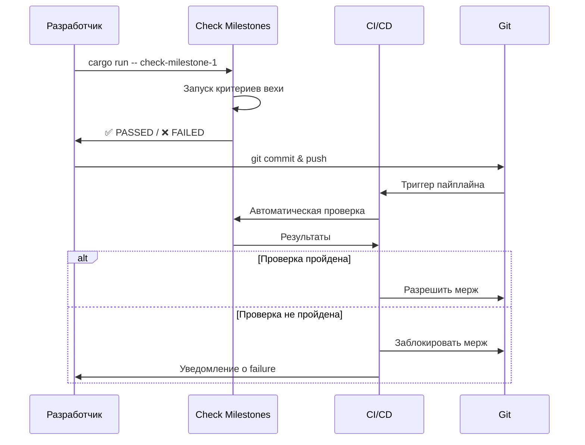

# [Check Milestones 🚀](zsh-ollama-terminal/crates/check-milestones/README.md)

## Система Quality Gates и отслеживания вех для проекта zsh-ollama-terminal

## Архитектура системы



## Структура проекта

```text
zsh-ollama-terminal/crates/check-milestones/
├── 📁 src/
│   ├── 🦀 lib.rs              # Основной модуль и экспорты
│   ├── 🦀 quality_gates.rs    # Ядро системы Quality Gates
│   ├── 🦀 milestone_gates.rs  # Определения критериев для каждой вехи
│   ├── 🦀 progress_tracker.rs # Отслеживание прогресса и отчеты
│   └── 🦀 main.rs            # CLI интерфейс
├── 📄 Cargo.toml             # Конфигурация зависимостей
├── 📄 Justfile               # Автоматизация команд
└── 📄 README.md              # Документация
```

## Быстрый старт

### Установка

Добавь в корневой `Cargo.toml` рабочего пространства:

```toml
[workspace]
members = [
    "crates/*",
    "crates/check-milestones",
]
```

### Базовое использование

```bash
# Проверить веху 1
cargo run -p check-milestones -- check-milestone-1

# Сгенерировать отчет о прогрессе
cargo run -p check-milestones -- progress-report

# Проверить все вехи
cargo run -p check-milestones -- check-all
```

## Детальное использование

### Команды CLI

#### Проверка отдельных вех

```bash
# Основные команды проверки
cargo run -p check-milestones -- check-milestone-1
cargo run -p check-milestones -- check-milestone-2
cargo run -p check-milestones -- check-milestone-3
cargo run -p check-milestones -- check-milestone-4
cargo run -p check-milestones -- check-milestone-5
cargo run -p check-milestones -- check-milestone-6

# С дополнительными опциями
cargo run -p check-milestones -- check-milestone-1 --verbose
cargo run -p check-milestones -- check-milestone-2 --output json
cargo run -p check-milestones -- check-milestone-3 --output markdown
```

#### Проверка всех вех

```bash
# Последовательная проверка всех вех
cargo run -p check-milestones -- check-all

# С подробным выводом
cargo run -p check-milestones -- check-all --verbose

# Генерация отчета в Markdown
cargo run -p check-milestones -- check-all --output markdown
```

#### Отчеты и информация

```bash
# Генерация отчета о прогрессе
cargo run -p check-milestones -- progress-report
cargo run -p check-milestones -- progress-report --output json
cargo run -p check-milestones -- progress-report --output markdown

# Информация о вехах
cargo run -p check-milestones -- info                    # Все вехи
cargo run -p check-milestones -- info 1                  # Конкретная веха
cargo run -p check-milestones -- info 2 --output json    # В формате JSON
```

### Флаги командной строки

| Флаг | Описание | Пример |
|------|-----------|---------|
| `--verbose` / `-v` | Подробный вывод | `--verbose` |
| `--output` / `-o` | Формат вывода: `text`, `json`, `markdown` | `--output json`|
| `--help` / `-h` | Справка по командам | `--help` |

### Использование как библиотеки

```rust
use check_milestones::{MilestoneGates, ProgressTracker, Milestone};

// Проверка конкретной вехи
let gate = MilestoneGates::milestone_1();
let result = gate.check();

if result.passed {
    println!("Веха 1 пройдена!");
} else {
    eprintln!("Веха 1 не пройдена: {}", result.message);
}

// Отслеживание прогресса
let mut tracker = ProgressTracker::new();
tracker.update_milestone(Milestone::Foundation, result);
let report = tracker.generate_report();

// Сохранение отчета
std::fs::write("progress_report.md", report.to_markdown())?;
```

## Майлстоуны

### Веха 1: Foundation Complete ✅

**Цель:** Базовая инфраструктура и основные типы

```rust
// Критерии качества:
- Компиляция проекта без ошибок
- Прохождение всех тестов  
- Генерация документации без предупреждений
- Проверка форматирования кода
- Отсутствие предупреждений clippy
```

**Команда проверки:**

```bash

cargo run -p check-milestones -- check-milestone-1
```

### Веха 2: Infrastructure Ready 🔧

**Цель:** Безопасность, клиент Ollama, файловые операции

```rust
// Критерии качества:
- Работа валидатора безопасности
- Интеграция клиента Ollama
- Безопасные файловые операции
- Кросс-платформенные абстракции
- Соответствие бенчмаркам производительности
```

**Команда проверки:**

```bash
cargo run -p check-milestones -- check-milestone-2
```

### Веха 3: AI Core Functional 🧠

**Цель:** Анализ команд, обнаружение галлюцинаций, движок обучения

```rust
// Критерии качества:
- Рабочий пайплайн анализа команд
- Обнаружение галлюцинаций с точностью >90%
- Реализованный и протестированный движок обучения
- Соответствие целевым показателям производительности
- Кеш-система, снижающая задержку на >60%
```

**Команда проверки:**

```bash
cargo run -p check-milestones -- check-milestone-3
```

### Веха 4: Web Interface Live 🌐

**Цель:** Веб-сервер, шаблоны Tera, HTMX взаимодействия

```rust
// Критерии качества:
- Корректный рендеринг шаблонов Tera
- Рабочие HTMX взаимодействия без JavaScript
- Типизированные HTTP ответы с security headers
- Переиспользуемые и документированные компоненты
- Веб-сервер, обрабатывающий >100 RPS
```

**Команда проверки:**

```bash
cargo run -p check-milestones -- check-milestone-4
```

### Веха 5: Integration Complete 🔄

**Цель:** Интеграция демона, CLI команд, shell интеграция

```rust
// Критерии качества:
- Демон со всеми интегрированными сервисами
- Функциональные CLI команды с обработкой ошибок
- Интеграция с оболочками (ZSH, Bash, Fish)
- Надежная и производительная IPC связь
- Рабочий мониторинг здоровья
```

**Команда проверки:**

```bash
cargo run -p check-milestones -- check-milestone-5
```

### Веха 6: Production Ready 🚀

**Цель:** Готовность к продакшену

```rust
// Критерии качества:
- Прохождение всех unit и интеграционных тестов
- Соответствие всем целевым показателям производительности
- Чистые security аудиты без критических уязвимостей
- Полная и актуальная документация
- Успешное кросс-платформенное тестирование
```

**Команда проверки:**

```bash
cargo run -p check-milestones -- check-milestone-6
## Процесс работы



## Интеграция с CI/CD

### GitHub Actions

```yaml
name: Quality Gates

on:
  push:
    branches: [ main, develop ]
  pull_request:
    branches: [ main ]

jobs:
  quality-gates:
    runs-on: ubuntu-latest
    steps:
      - uses: actions/checkout@v4
      
      - name: Setup Rust
        uses: actions-rust-lang/setup-rust-toolchain@v1
        with:
          toolchain: stable
          
      - name: Check Milestone 1
        run: cargo run -p check-milestones -- check-milestone-1
        if: github.ref == 'refs/heads/develop'
        
      - name: Check Milestone 2
        run: cargo run -p check-milestones -- check-milestone-2
        if: contains(github.event.pull_request.labels.*.name, 'milestone-2')
        
      - name: Check All Milestones
        run: cargo run -p check-milestones -- check-all
        if: github.ref == 'refs/heads/main'
        
      - name: Generate Progress Report
        run: cargo run -p check-milestones 
              -- progress-report 
              --output markdown > progress.md
        if: always()
        
      - name: Upload Progress Report
        uses: actions/upload-artifact@v4
        with:
          name: progress-report
          path: progress.md
        if: always()
```

### GitLab CI

```yaml
stages:
  - quality-gates

quality_check:
  stage: quality-gates
  image: rust:latest
  script:
    - cargo run -p check-milestones -- check-milestone-$CI_COMMIT_REF_NAME
  rules:
    - if: $CI_COMMIT_REF_NAME == "develop"
    - if: $CI_COMMIT_REF_NAME =~ /^milestone-/
```

## Конфигурация

### Переменные окружения

```bash
# Для детального вывода
export RUST_BACKTRACE=1

# Для интеграционных тестов
export OLLAMA_HOST=localhost
export OLLAMA_PORT=11434

# Таймауты (в секундах)
export QUALITY_GATE_TIMEOUT=300
```

### Кастомизация критериев

Создай кастомные Quality Gates:

```rust
use check_milestones::QualityGate;

let custom_gate = QualityGate::new("Custom Milestone")
    .add_criterion("custom_check", "cargo test custom", "Custom test")
    .add_optional_criterion("optional_check", "cargo bench custom", "Optional benchmark")
    .with_env("CUSTOM_VAR", "value")
    .set_strict_mode(false);
```

## Разработка

### Тестирование

```bash
# Запуск тестов
cargo test

# Тестирование с подробным выводом
cargo test -- --nocapture

# Бенчмарки
cargo bench
```

### Добавление новых критериев

1. Открой `src/milestone_gates.rs`
2. Найди нужную веху
3. Добавь новый критерий:

```rust
.add_criterion(
    "new_criterion",
    "cargo test new_feature",
    "Описание нового критерия"
)
```

## Использование с Just

Для удобства мы предоставляем `Justfile` с готовыми командами.

### Установка Just

```bash
# macOS
brew install just

# Ubuntu/Debian
curl    --proto '=https' \
        --tlsv1.2 -sSf https://just.systems/install.sh | bash -s -- --to /usr/local/bin

# Cargo
cargo install just
```

### Основные команды Just

```bash
# 🚀 Проверка вех
just check-milestone-1      # Проверить веху 1
just check-all             # Проверить все вехи
just cm1                   # Краткая форма

# 📊 Отчеты
just progress-report       # Отчет о прогрессе
just progress-report-json  # Отчет в JSON
just daily-report         # Ежедневный отчет

# 🔍 Информация
just info                  # Информация о всех вехах
just info-1               # Информация о вехе 1

# 🛠️ Разработка
just test                  # Запустить тесты
just clippy               # Проверка clippy
just fmt                  # Форматирование кода

# Полный список команд
just list
```

## Примеры рабочих процессов

### Полный рабочий процесс

```bash
# 1. Начать разработку новой вехи
just info-2

# 2. Регулярно проверять прогресс
just check-milestone-2 --verbose

# 3. При завершении - полная проверка
just check-milestone-2 --output markdown > milestone_2_report.md

# 4. Обновить трекер прогресса
just progress-report --output json > progress.json

# 5. Интегрировать в CI
just check-all
```

### Ежедневный рабочий процесс

```bash
# Утро - проверка статуса
just status
just progress-report

# В течение дня - быстрые проверки
just quick-check          # Быстрая проверка
just test                 # Только тесты
just cm1 --verbose        # Детальная проверка вехи 1

# Вечер - отчеты
just daily-report         # Ежедневный отчет
```

## Лицензия

MIT OR Apache-2.0

## Поддержка

При возникновении проблем или вопросов:

1. Проверь вывод с `--verbose` флагом
2. Убедись, что все зависимости установлены
3. Проверь, что команды выполняются в правильной директории
4. Сгенерируй отчет для детального анализа:

  ```sh
  cargo run -p check-milestones -- progress-report --output json`
  ```

---

**Примечание:**
Эта система предназначена для обеспечения качества на каждом этапе разработки.
Регулярное использование поможет поддерживать высокие стандарты кода
и предотвращать накопление технического долга.

README содержит:

1. **Диаграмму архитектуры** - показывает как система интегрирована в проект
2. **Структуру проекта** - дерево файлов с иконками
3. **Правильную разметку** - таблицы, блоки кода, последовательности
4. **Процесс работы** - sequence diagram взаимодействия
5. **Примеры CI/CD** - готовые конфигурации
6. **Команды Just** - автоматизация рабочих процессов
7. **Визуальные разделители** - четкое разделение секций
